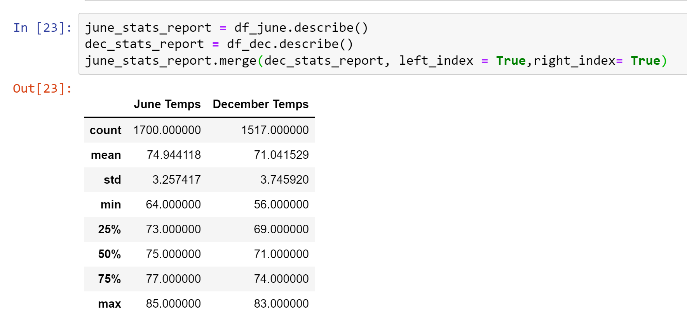
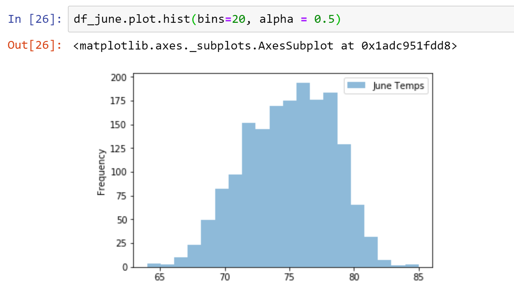

# surfs_up
Advanced Data Storage and Retrieval using `Jupyter Notebook`, `SQLite` and `SQLAlchemy`
​
## Overview of the Analysis
---
This project presents an analyis of temperature trends in Hawaii. The summary statistics of temperature data were requested for the months of June and December to get an insight if the surf and ice cream shop business is sustainable year-round.
​
### FEATURES AND DATA SOURCES
- Data Source: `hawaii.sqlite`
- Programming Files: `SurfsUp_Challenge.ipynb`
- Data Tools: `Python SQL toolkit (SQLAlchemy)`, `Object Relational Mapper`, `pandas`, `numpy`
- Software: SQLlite, Python 3, Flask, Jupyter Notebook
​
### Deliverables
- Deliverable 1: Determine the Summary Statistics for June
- Deliverable 2: Determine the Summary Statistics for December
- Deliverable 3: A written report for the statistical analysis (README.md)
​
## Results
---
- _Summary Statistics DataFrame: June vs December Temperatures_

​
#### Key Differences in Weather: 
- The average recorded temperature in June is around 4 degrees higher than the average temp in December.
- This indicated a -5% change in average temperature from June to December
- The December temperatures are more varied than in June if the the maximum and mimimum temperatures are looked at.
- However it is seen that the median temperature in Dec is more inline with the average.
   
## Summary
​
- _June records in histogram(Temperature and Frequency)_

​
- _December records in histogram(Temperature and Frequency)_

​
Temperatures in December varies more than that in June.
The frequency of temperatures recorded in June tends to more normal, a tight bell curve distribution.
However,temperatures in June and December only differ by 4 degrees.
Therefore it can be safely concluded that both June and December are suitable for surfing and running ice cream business.
